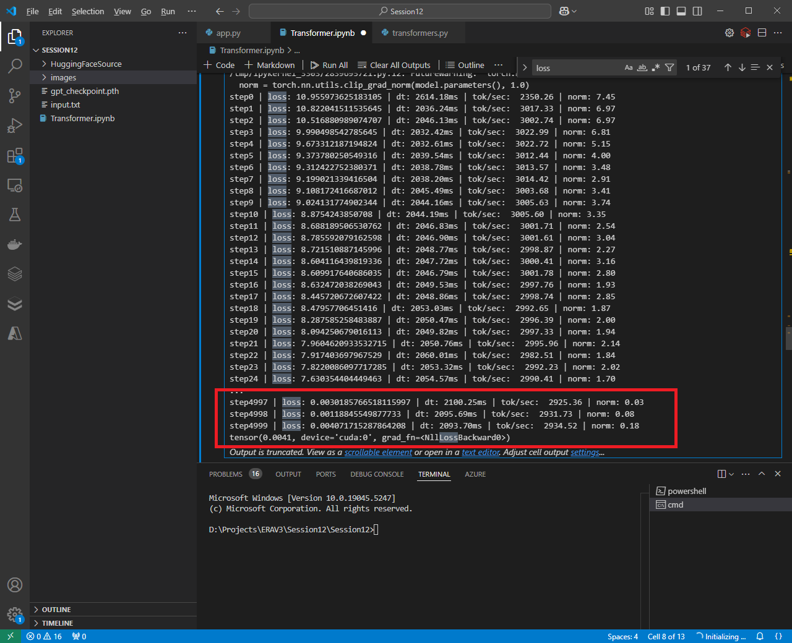
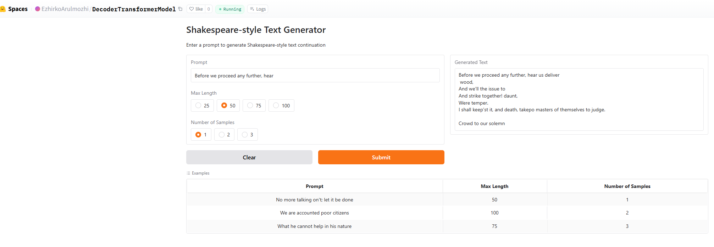

# Shakespeare-Style Text Generator with Decoder-Only Transformer

This repository contains a basic decoder-only Transformer model trained from scratch on Shakespearean dialogue-based text data. The model has 124M trainable parameters and has been trained to achieve a target loss of **0.099**.

## Model Details
- **Architecture**: Decoder-only Transformer
- **Trainable Parameters**: 124M
- **Training Steps**: 5000
- **Batch Size**: 6
- **Number of Tokens**: 50,000
- **Embedding Dimensions**: 768
- **Maximum Sequence Length**: 1024

## Training Process
The model was trained on Colab with the following highlights:
- **Optimizer**: AdamW with a learning rate scheduler
- **Loss Function**: Cross-entropy loss
- **Target Loss**: Successfully achieved a loss below 0.099 after 5000 steps

### Training Logs
Here is a snippet of the training logs showing the progress towards the target loss:



---

## Demo Application
The trained model is deployed on Hugging Face Spaces as an interactive app. You can enter a prompt, and the model will generate Shakespeare-style text continuations.

### Features
- **Prompt Input**: Provide a custom text prompt.
- **Output**: Generates a Shakespeare-style continuation based on the input prompt.
- **Dynamic Interactivity**: Select generation length and the number of samples dynamically.

Visit the Hugging Face Spaces app here: [Hugging Face Spaces Link](https://huggingface.co/spaces/EzhirkoArulmozhi/DecoderTransformerModel)

### Hugging Face Demo Output
Below is a screenshot of the deployed app with sample outputs:



---

## Repository Structure
├── Transformer.ipynb # Training script for the Transformer model 
├── README.md # This file 
├── input.txt # Training data
├── HuggingFaceSource # Source folder for Huggingface model deployment
    ├── app.py # Gradio-based app for demo
    ├── requirements.txt # Python dependencies 
    ├── transformers.py # Transformer model file and configuration file
└── images/ # Screenshots for demo and logs 
    ├── Logs.png  
    ├── gradioapp.png

## How to Run the Demo Locally
1. Clone the repository:
    ```bash
    git clone https://github.com/Ezhirko/Creative-AI-apps.git

2. Install dependencies:
    ```bash
    pip install -r requirements.txt


## Future Work
- Fine-tune the model on more extensive Shakespearean datasets.
- Extend the model to support multilingual text generation.
- Experiment with model scaling (larger Transformer models) for enhanced performance.


