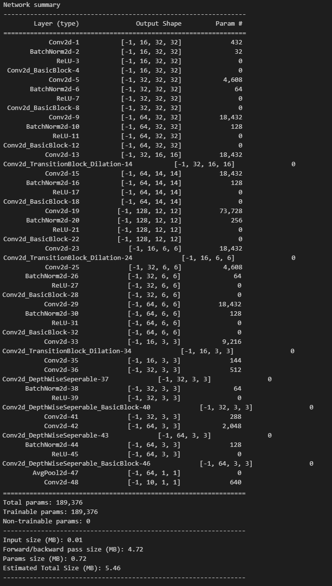

# CIFAR-10 Classification with Depthwise Separable CNN and Dilation

This repository implements a Convolutional Neural Network (CNN) architecture for classifying the CIFAR-10 dataset. The architecture employs Depthwise Separable Convolutions and dilation to improve the receptive field while maintaining a lightweight model with only 189,376 parameters.

## Key Features

- **Dataset**: CIFAR-10
  - Preloaded using `torchvision.datasets.CIFAR10`
  - Data augmentation applied with the `albumentations` library.

- **Model Architecture**:
  - Four convolution blocks with transition layers.
  - Transition layers use strided convolutions with dilation (stride=2, dilation=2) to increase the receptive field (RF) instead of max pooling.
  - Depthwise Separable Convolution used in one convolution block to optimize the number of parameters.
  - Global Average Pooling layer in the output block.
  - Total Receptive Field (RF): 115.
  - Total Parameters: 189,376.
  - Model Summary <br>


- **Data Augmentation**:
  - Horizontal Flip
  - ShiftScaleRotate
  - CoarseDropout:
    - `max_holes=1`, `max_height=16px`, `max_width=16px`
    - `min_holes=1`, `min_height=16px`, `min_width=16px`
    - `fill_value=(mean of dataset)`, `mask_fill_value=None`

- **Training**:
  - Achieved >85% accuracy in 35 epochs.
  - Learning rate scheduler: `StepLR` for faster convergence.

- **Modular Code Design**: Organized into directories for easy extensibility and maintenance.

## Directory Structure

```
DilationDepthWiseConvolutionModel/
|-- config/
    |-- config.json
|-- data/
    |-- cifar10_data_loader.py
    |-- cifar10_dataset.py
    |-- data_loader.py
    |-- datasets.py
|-- models/
    |-- base_network_utils.py
    |-- cifar10_dialation_dsc_noMaxpool.py
|-- training/
    |-- optimizers.py
    |-- trainer.py
|-- utils/
    |-- visualization.py
|-- main.ipynb
```

## Requirements

- Python 3.x
- PyTorch
- Albumentations
- Torchvision
- Other dependencies in `config.json`

## Usage

### 1. Clone the Repository
```bash
git clone https://github.com/Ezhirko/Creative-AI-apps.git
cd Creative-AI-apps/DilationDepthWiseConvolutionModel
```

### 2. Install Dependencies
Ensure all required libraries are installed. Use the provided `config.json` to check dependency versions.

### 3. Run the Training Script
Run `main.ipynb` to execute the training pipeline, visualize metrics, and evaluate the model.

### 4. Customize Configurations
Edit `config/config.json` to modify hyperparameters, data paths, and other settings.

## Results

The model achieves an accuracy of over **85%** on the CIFAR-10 dataset within 35 epochs. The learning rate scheduler (`StepLR`) ensures faster convergence.

## Contribution
Feel free to open issues or submit pull requests for feature enhancements or bug fixes.

## License
This project is licensed under the MIT License - see the LICENSE file for details.

---

For any questions or feedback, please contact [ezhirko.arulmozhi@gmail.com].
