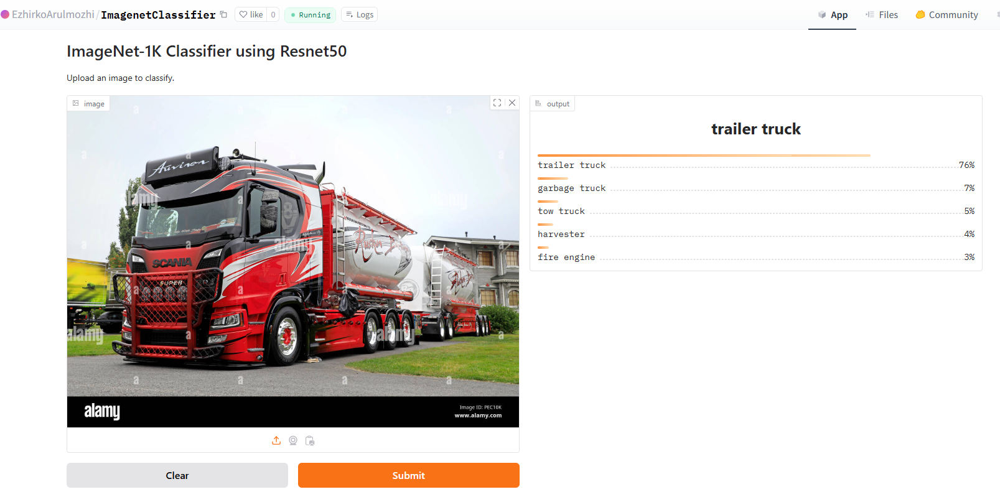

# ResNet50 Training on ImageNet Dataset

This repository documents the process of training a ResNet50 model on the ImageNet 1K dataset using PyTorch. The training was carried out in two stages: first on the TinyImageNet dataset for experimentation and then on the full ImageNet 1K dataset on AWS EC2 instances.

## Objective
To train the ResNet50 model from scratch on the ImageNet 1K dataset with 1,000 classes, without using pretrained weights. This project explores the challenges and solutions for training a deep learning model on a large-scale dataset, especially using cloud infrastructure.

---

## Project Workflow

### Stage 1: Training on TinyImageNet
- **Dataset**: Used the TinyImageNet dataset (a subset of ImageNet).
- **Platform**: Google Colab.
- **Goal**: Develop and test the following:
  - DataLoader pipeline
  - Data augmentation strategies
  - ResNet50 model architecture
  - Train and test functions in PyTorch
- **Outcome**: Verified the implementation on a smaller dataset.

### Stage 2: Training on ImageNet 1K Dataset

#### Preparation
- **Platform**: AWS EC2.
- **Instance Configuration**:
  - **Initial Cluster**: g4dn.xlarge (4 CPUs, 16GB GPU)
  - **Training Cluster**: g5.8xlarge (32 CPUs, 128GB GPU)
- **Dataset**:
  - **Source**: [Kaggle ImageNet Object Localization Challenge](https://www.kaggle.com/competitions/imagenet-object-localization-challenge/data)
  - **Size**:
    - Compressed: 150 GB
    - Extracted: 375 GB
  - **Storage**: Mounted EBS volume on the EC2 instance to handle large data.

#### Training
- **Challenges**:
  - Frequent SSH disconnections required restarting training.
  - Implemented checkpointing to save model state and training parameters after each epoch.
- **Outcome**:
  - Trained for 3 epochs.
  - Achieved a test accuracy of **38%**.

---

## Model Deployment
- **Repository**:
  - Model uploaded to [Hugging Face Model Hub](https://huggingface.co/EzhirkoArulmozhi/Resnet50_Imagenet1k).
- **Demo**:
  - Developed a Gradio application to classify images using the trained model.
  - Access the application here: [Hugging Face Space](https://huggingface.co/spaces/EzhirkoArulmozhi/ImagenetClassifier).

---

## Key Learnings
1. **ResNet Model Architecture**: In-depth understanding of ResNet50.
2. **Schedulers**: Experimented with learning rate schedulers, specifically OneCycleLR.
3. **Large Dataset Handling**: Managed and processed large datasets on cloud platforms.
4. **AWS EC2 Training**: Hands-on experience with AWS GPU instances and troubleshooting cloud-specific issues.

---

## Screenshots
### 1. Gradio Application UI

---

## License
This project is licensed under the MIT License. See the LICENSE file for details.

---

## Acknowledgments
Special thanks to the following:
- [Kaggle](https://www.kaggle.com/) for providing the ImageNet dataset.
- [Hugging Face](https://huggingface.co/) for hosting the model and Gradio app.
- [AWS](https://aws.amazon.com/) for providing robust GPU instances for model training.

---

### Author
**Ezhirko Arulmozhi**
